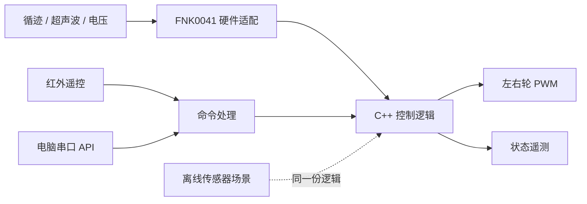

# 控制程序

[README](../README.md) · [协议](control-protocol.md) · [校准](calibration.md)

## 数据如何流动

`controller.cpp` 只处理输入、时间和输出，不包含 Arduino API。`fnk0041_io.cpp` 读写真实引脚；Unity 测试用假 I/O 检查该适配层。`robot_car.ino` 组合控制器、串口和红外接收。回放使用同一份 C++ 决策代码，不是另写一套 Python 算法。

## 模式和停车规则

上电模式为 `idle`。启动命令必须指定 `line` 或 `manual`，并通过电压、传感器新鲜度、转头等待时间和前方距离检查。处于运行模式时不能直接切换模式或抢占控制来源，先 STOP 再启动。

| 状态 | 行为 | 如何离开 |
| --- | --- | --- |
| `following` | 根据三路黑线位调整两侧 PWM | 指令、障碍、脱线或故障 |
| `obstacle` / `clear_wait` | 循迹模式下保持零 PWM | 距离达到恢复阈值，持续 600 ms，至少三次不同测距，且线型有效 |
| `line_lost` | 立即零 PWM；400 ms 内可重新捕获线 | 超时后退出模式，必须重新 ARM |
| `ambiguous_line` | `101` 或 `111` 视为无法确定路径，退出模式 | 放回单条线路后重新 ARM |
| `manual` | 使用最近的有效左右轮指令 | 350 ms 未续发 DRIVE 后退出模式 |
| `sensor_fault` / `low_battery` | 退出模式并保持零 PWM | 排除问题后重新 ARM |
| `remote_timeout` | 退出模式并清空旧运动 | 重新 ARM；迟来的 PING/DRIVE 不会恢复 |
| `stopped` / `command_error` | 零 PWM，清空所有待执行运动 | 明确重新 ARM |

所有控制模式的测距/电压检查都有效。手动模式遇障直接退出，不自动恢复。缺少回波、距离小于 20 mm 或大于 4000 mm、测距达到 250 ms 未更新、整体输入达到 100 ms 未更新都会停车。测距为 16 位毫米值，不沿用原厂示例的 8 位距离数组。

三路数字输入按左、中、右组合：`010` 直行；`100/110` 左修正；`001/011` 右修正；`000` 脱线；`101/111` 歧义线型。此版不是交叉路口规划或 PID 模拟量循迹。

## 控制来源

- 红外 `1/2` 仅启动一次；NEC 重复帧只能延续方向/停车操作，不反复 ARM。
- 手动方向释放后不再续发，默认 350 ms 停止驱动。超过 180 ms 的孤立红外重复帧被忽略。
- 串口控制的模式有 1200 ms 连接租约；PING 可保持循迹，不能延长手动 DRIVE 的 350 ms 租约。
- 红外启动的循迹模式不需要电脑心跳。
- STOP 不受控制来源限制。状态查询不续租。故障后的旧 DRIVE 不保留。

## 引脚和定时

| 引脚 | 用途 |
| --- | --- |
| D2 | 超声波转头舵机 |
| D4 / D6 | 左侧方向 / PWM |
| D3 / D5 | 右侧方向 / PWM |
| D7 / D8 | 超声波 Trigger / Echo |
| D9 | 红外接收器 |
| A0 | 电池分压读数，与原厂蜂鸣器控制共用，项目保持输入模式 |
| A1 / A2 / A3 | 左 / 中 / 右循迹 |
| D0 / D1 | USB 串口路径，与蓝牙扩展共用 |

Servo 使用 Timer1，旧版 IRremote 接收使用 Timer2；电机 PWM D5/D6 使用 Timer0。未同时引入 RF24 或厂商手机协议。

舵机在启动时居中并等待 400 ms。超声波间隔至少 60 ms，使用有 25 ms 上限的 `pulseIn`；因此它是**有界阻塞读数**，不是完全无阻塞驱动。状态逻辑不使用延时，串口每次循环最多消费 32 字节，遥测约每 200 ms 输出一次。实际停车延迟还包含当前 I/O 周期、传输和机械滑行，需要实测。

左右电机正转电平不同，适配层按原厂映射处理。反转前先输出一次零 PWM。电机输出是开环 PWM，没有编码器测速；遥测 PWM 不是测得的轮速。

参数及限制见 [config.h](../firmware/robot_car/config.h)。非法配置不能 ARM。测试夹具使用固定基准配置，以便实际校准参数改变时仍能回归检查控制算法。
