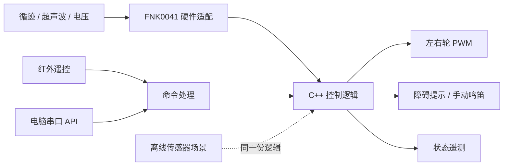

# 控制程序

[README](../README.md) · [协议](control-protocol.md) · [校准](calibration.md)

## 数据如何流动

`controller.cpp` 只处理输入、时间和输出，不包含 Arduino API。`fnk0041_io.cpp` 读写真实引脚；Unity 测试用假 I/O 检查该适配层。`robot_car.ino` 组合控制器、串口和红外接收。回放使用同一份 C++ 决策代码，不是另写一套 Python 算法。

## 模式和停车规则

上电模式为 `idle`。启动命令必须指定 `line` 或 `manual`，并通过电压、传感器新鲜度、转头等待时间和前方距离检查。普通 `ARM` 流程在运行时不能直接切换模式或抢占控制来源，先 STOP 再启动。App 的紧凑 `R left right` 命令是明确的串口遥控接管接口：非零指令会原子地进入手动模式并更新两轮输出，避免旧版 STOP / SPEED / ARM / DRIVE 多帧交错。

| 状态 | 行为 | 如何离开 |
| --- | --- | --- |
| `following` | 根据三路黑线位调整两侧 PWM；采用 App 选择的步进或正常混合输出 | 指令、障碍、脱线或故障 |
| `obstacle` / `clear_wait` | 循迹模式下保持零 PWM；障碍仍在停止阈值内时短促鸣叫 | 距离达到恢复阈值，持续 600 ms，至少三次不同测距，且线型有效 |
| `line_lost` | 立即零 PWM，但保留循迹待命模式 | 重新捕获有效线型后自动继续，或按 `0` 退出 |
| `ambiguous_line` | `101` 无法确定路径时零 PWM 等待 | 放回单条线路后自动继续，或按 `0` 退出 |
| `manual` | 使用最近的有效 `R` 或 `DRIVE` 左右轮指令 | 350 ms 未续发运动指令后退出模式 |
| `sensor_fault` / `low_battery` | 退出模式并保持零 PWM | 排除问题后重新 ARM |
| `remote_timeout` | 退出模式并清空旧运动 | 重新 ARM；迟来的 PING/DRIVE 不会恢复 |
| `stopped` / `command_error` | 零 PWM，清空所有待执行运动 | 明确重新 ARM |

所有控制模式的测距/电压检查都有效。手动模式检测到 200 mm 内障碍时，只阻止左右轮合计为正的前向运动并保留遥控会话；倒车和原地转向仍可用于脱离障碍。缺少回波、距离小于 20 mm 或大于 4000 mm、测距达到 250 ms 未更新、整体输入达到 100 ms 未更新都会停车。ARM 前低于 6.6 V 会直接拒绝；运行中低压必须连续保持 300 ms 才锁定停车，以滤除四电机启动浪涌造成的单次 ADC 瞬态。测距为 16 位毫米值，不沿用原厂示例的 8 位距离数组。

三路数字输入按左、中、右组合：`010` 直行；`100/110` 左修正；`001/011` 右修正；`000` 脱线等待；`101` 歧义等待；`111` 因无法区分全黑与传感器悬空而停车等待。此版不是交叉路口规划或 PID 模拟量循迹。

## 控制来源

- 红外 `1/2` 仅启动一次；NEC 重复帧只能延续方向/停车操作，不反复 ARM。
- 手动方向释放后不再续发，默认 350 ms 停止驱动。超过 180 ms 的孤立红外重复帧被忽略。
- 串口控制的模式有 1200 ms 连接租约；PING 可保持循迹，不能延长手动 DRIVE 的 350 ms 租约。
- App 每 50 ms 最多发送一帧紧凑 `R` 指令；BLE 队列只保留最新的尚未发送遥控帧，松手时优先发送 `R 0 0`。反向前由 App 先经过一帧零输出。
- 红外启动的循迹模式不需要电脑心跳。
- STOP 不受控制来源限制。状态查询不续租。故障后的旧 DRIVE 不保留。

## 引脚和定时

| 引脚 | 用途 |
| --- | --- |
| D2 | 超声波转头舵机 |
| D4 / D6 | 左侧方向 / PWM |
| D3 / D5 | 右侧方向 / PWM |
| D7 / D8 | 超声波 Trigger / Echo |
| D9 | 红外接收器 |
| A0 | 电池分压与有源蜂鸣器共用；鸣叫时为输出，静音时恢复输入并采样 |
| A1 / A2 / A3 | 左 / 中 / 右循迹 |
| D0 / D1 | USB 串口路径，与蓝牙扩展共用 |

Servo 使用 Timer1，旧版 IRremote 接收使用 Timer2；电机 PWM D5/D6 使用 Timer0。未同时引入 RF24 或厂商手机协议。

舵机在启动时居中并等待 400 ms。超声波间隔至少 60 ms，使用有 25 ms 上限的 `pulseIn`；因此它是**有界阻塞读数**，不是完全无阻塞驱动。障碍提示每 700 ms 最多鸣叫 100 ms；App 长按鸣笛使用 120 ms 响、30 ms 静的节奏，`H 1` 必须在 1500 ms 内续租，`H 0` 或 STOP 立即关闭。A0 与电池 ADC 共用，因此所有鸣叫都在静音窗口恢复输入并采样。现有板载器件是有源蜂鸣器，只能开关形成节奏或短提示，不能可靠演奏不同音高的旋律。状态逻辑不使用 `delay()`，串口每次循环最多消费 32 字节，遥测约每 200 ms 输出一次。实际停车延迟还包含当前 I/O 周期、传输和机械滑行，需要实测。

循迹与手动速度相互独立。“步进”以 `line_pulse_pwm = 120` 对所有有效线型采用 80 ms 驱动 / 80 ms 零输出；“正常”使用混合策略：`010` 中线仍以 120 步进，`110/011` 侧偏连续输出内轮 0、外轮 `line_turn_pwm = 150`，`100/001` 严重偏移连续输出 `-150/150` 或 `150/-150` 原地转向。转弯专用 150 来自本车双向电机测试和反向冷启动观察，不提高直线速度。旧 `LINE CONTINUOUS` 命令保留为诊断接口，但不再由 App 选择。所有相位基于 `millis()`，不使用 `delay()`；每次循环都先检查 STOP、通信租约、丢线、歧义、障碍、低压和传感器故障。`000/101/111` 或任何等待/故障都立即清零，不做盲转。App 仅能在停车状态切换循迹档位，并按 STOP、`LINE PULSE|HYBRID`、`ARM LINE` 的顺序启动；红外 `1` 固定使用步进。App 摇杆上限仅影响手动和语音方向，不改变循迹参数。

左右电机正转电平不同，适配层以原厂映射为基线；本车架空实测确认原厂正向实际为倒车，因此 `invert_left_motor` 与 `invert_right_motor` 均设为 `true`。反转前先输出一次零 PWM。电机输出是开环 PWM，没有编码器测速；遥测 PWM 不是测得的轮速。

Freenove 官方定义黑色或无反射物为高电平、白色为低电平；硬件层使用 `black_reads_high = true`，将原始三路值直接作为“黑线位 = 1”交给控制器。实车逐档观察确认 PWM 50–100 不能可靠起步，PWM 120 作为循迹脉冲的下一档启动幅值。固件兼容的手动数值范围为 50–200；App 为避免已知的冷启动死区，把用户可选上限限制为 110–200，默认 150。摇杆经过死区、曲线和左右差速混合后输出，低于起步门槛的非零量会抬到 110；这仍是开环 PWM，不是实际速度闭环。

参数及限制见 [config.h](../firmware/robot_car/config.h)。非法配置不能 ARM。测试夹具使用固定基准配置，以便实际校准参数改变时仍能回归检查控制算法。
